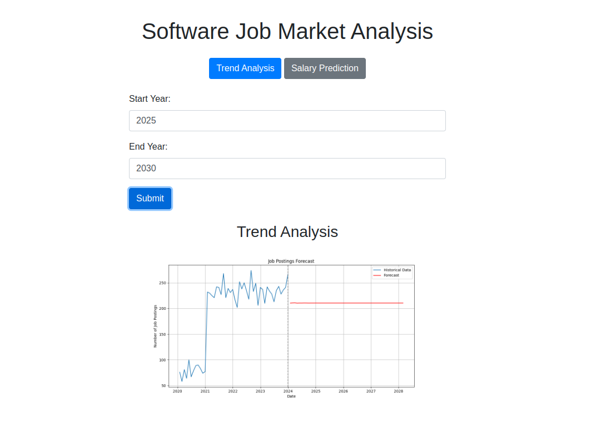
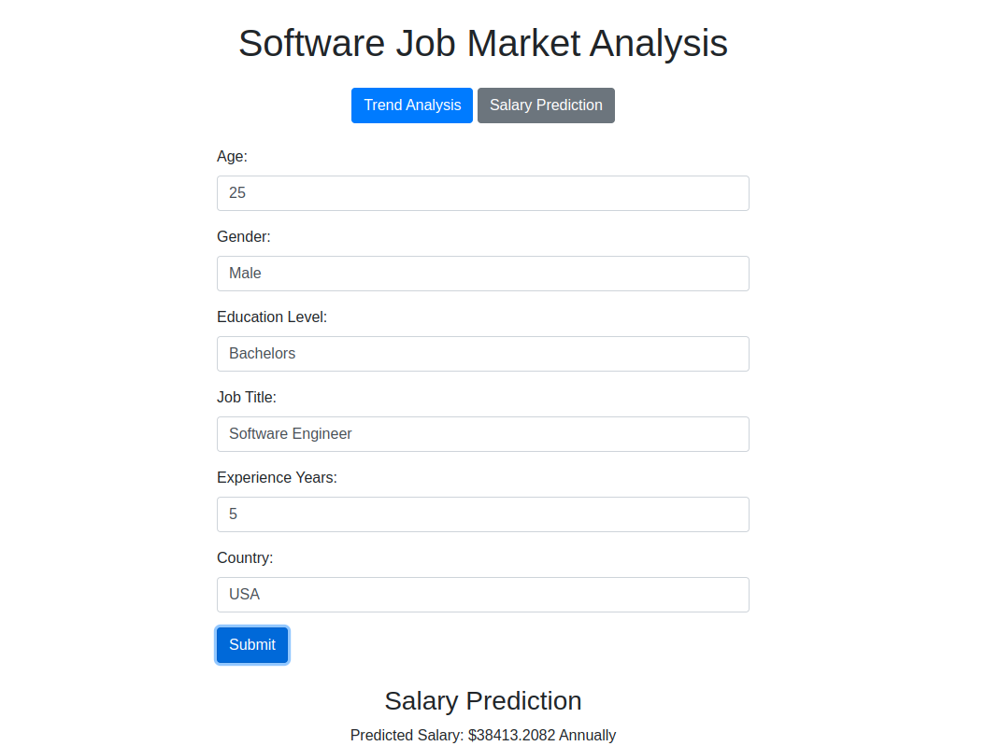

# Software-Job-Analysis
## Overview
In today's dynamic job market, understanding future trends and having insights into salary expectations can be incredibly valuable for both job seekers and employers. This model aims to provide accurate predictions by analyzing historical data and identifying key patterns.

### Trend Analysis: 
Identifies and forecasts future trends in various industries and job markets.
### Salary Prediction: 
Estimates salary ranges based on factors such as experience, education, industry, location, and more.
### Data Visualization: 
Provides clear and interactive visualizations to help interpret the results and insights.
Customizable: Easily adaptable to different datasets and variables for tailored predictions.
## How It Works
### Data Collection:
Gathers historical data on job trends and salaries from multiple sources.
### Data Preprocessing: 
Cleans and preprocesses the data to ensure accuracy and reliability.
Model Training: Utilizes machine learning algorithms to train the model on the preprocessed data.
### Prediction: 
Generates predictions for future trends and salary estimates.
### Evaluation: 
Assesses the model's performance using various metrics and fine-tunes it for better accuracy.
## Technologies Used
### Programming Language: 
Python
### Libraries: 
Pandas, NumPy, Scikit-learn, Matplotlib/Seaborn for visualization
### Data Sources:
Publicly available datasets and APIs
# Getting Started
To get started with Model, follow these steps:

1. Clone the Repository:

```bash
git clone git@github.com:Ararsa-Derese/Software-Job-Analysis.git
cd Software-Job-Analysis
code .
```
2. Create a virtual environment and activate 
```bash
python -m venv env
env/bin/activate
```
3. install the requirments
```bash
pip install -r requirements.txt
```
4. Train the model
```bash
run both Salary.ipynb and Trends.ipynb
```
5. Run the server

```
python app.py
```
# Usage
## Trend Analysis: 
Enter a Start date and end Date to see a Trend.

##  Salary Prediction: 
Input relevant details to receive a salary prediction.

## Contributions
Contributions are welcome! Please fork the repository and submit a pull request with your proposed changes.
